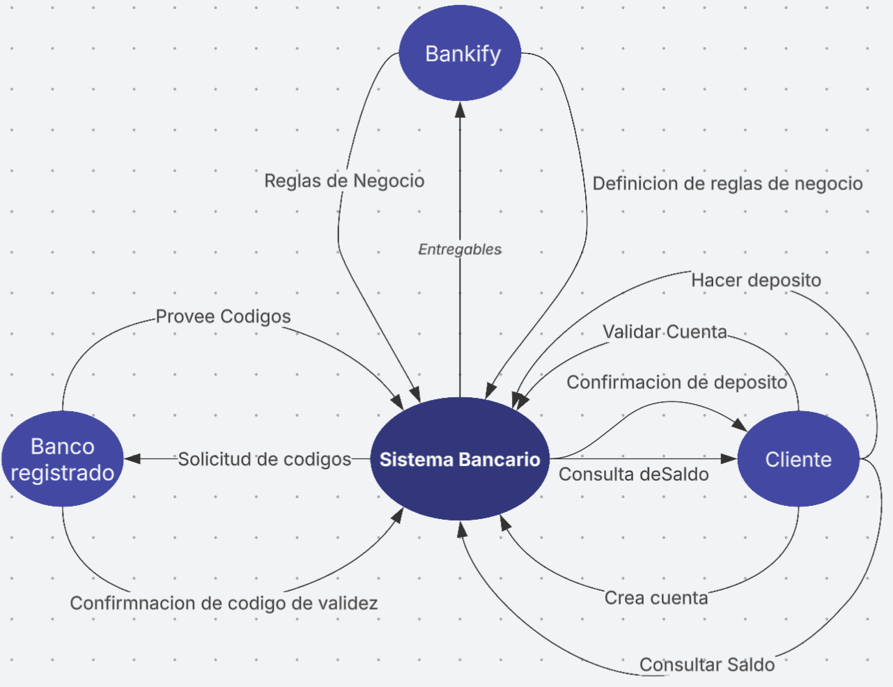
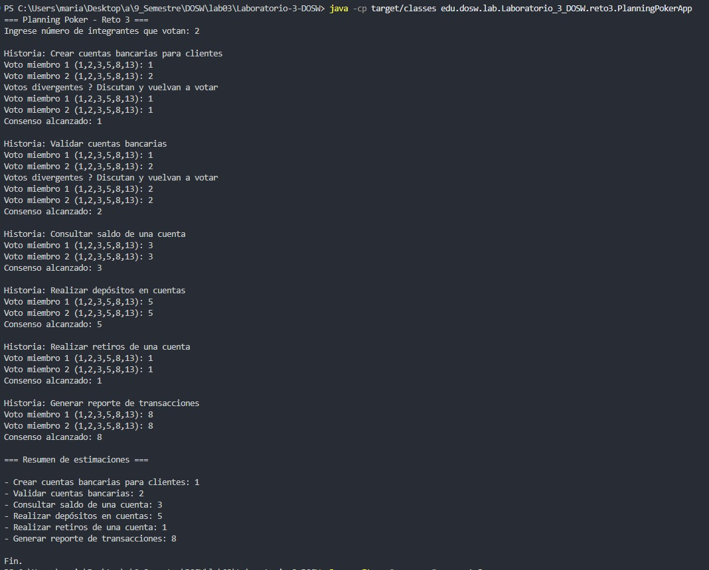

# 📝 Laboratorio 03 –

**Integrantes:**
- Daniel Eduardo Useche
- Marianella Polo Peña
- Sebastian Duque Ceballos

**Nombre de la rama:**  
- feature-UsecheDaniel-PoloMarianella-DuqueSebastian-2025-2


## Preguntas
A. ¿Cuál es la diferencia principal entre una prueba unitaria y una prueba de integración E2E?

- Una prueba unitaria verifica el funcionamiento correcto de una unidad de código (normalmente una función o método) de forma aislada.

- Una prueba E2E (End-to-End) valida el comportamiento de todo el sistema desde el punto de vista del usuario final, incluyendo todas las capas (interfaz, backend, base de datos).

##

B.	En Scrum ¿Cuál es el propósito de la Sprint Retrospective y porque es crucial para la mejora continua del equipo?

El objetivo de la "Sprint Retrospective" es que el equipo reflexione sobre cómo trabajaron durante el sprint anterior y propongan mejoras. Esto permite identificar errores, reforzar lo que funcionó bien y ajustar procesos, fomentando así la mejora continua.

##

C.	Explique la diferencia entre una Épica, una Feature y una historia de Usuario. Proporcione un ejemplo de cada una si tenemos un sistema de streaming de video como lo es Netflix.

- Una épica es un gran bloque de trabajo que puede abarcar múltiples funcionalidades.
Por ejemplo: "Proporcionar una experiencia personalizada al usuario."

- Una feature es una funcionalidad concreta dentro de una épica.
Por ejemplo: "Recomendar películas basadas en el historial de visualización."

- Una historia de usuario es un requisito pequeño y manejable desde la perspectiva del usuario.
Por ejemplo: "Como usuario, quiero ver una sección de ‘Películas recomendadas para mí’ en la página de inicio."

##

D.	¿Qué es una cobertura de Código (code coverage) y porque una cobertura del 100% no garantiza necesariamente que el software esté libre de errores?

La cobertura de código mide qué porcentaje del código fuente es ejecutado por las pruebas. Un 100% de cobertura no garantiza que el software esté libre de errores porque no asegura que todas las condiciones lógicas, combinaciones o casos de uso hayan sido probados adecuadamente.

##

E.	Describa que es un Diagrama de Casos de Uso y que elementos lo componen. ¿Para qué sirve en la fase de análisis de requerimientos?

Es una representación visual de cómo los usuarios (actores) interactúan con el sistema.
Elementos: Actores, casos de uso (funciones del sistema), relaciones (asociaciones, inclusiones, extensiones).
Sirve para entender los requerimientos funcionales y delimitar el alcance del sistema desde el punto de vista del usuario.

##

F.	¿Cuál es la diferencia entre el uso de Junit y Jacoco en un proyecto, y como complementa SonarQube este proceso en términos de calidad de software?

- JUnit es un framework para escribir y ejecutar pruebas unitarias en Java.

- JaCoCo es una herramienta que mide la cobertura de código de las pruebas ejecutadas.

- SonarQube analiza el código fuente y muestra métricas como cobertura, bugs, code smells, duplicación, etc., ofreciendo una visión completa de la calidad del software.

##

G.	¿Qué ventajas tiene el uso de Planning Poker frente a otros métodos de estimación tradicional y como ayuda a mejorar la transparencia y compromiso del equipo?

- Fomenta la participación de todos.

- Reduce el sesgo del "jefe" o del desarrollador más experimentado.

- Promueve discusiones técnicas valiosas.

- Al basarse en consenso, mejora la transparencia y el compromiso del equipo con las estimaciones.

##

H.	Menciona los valores de Scrum y explica cual consideras más difícil de aplicar en un equipo.

Valores de Scrum: Compromiso, Coraje, Enfoque, Respeto, Apertura.

La apertura suele ser complicada, especialmente en equipos donde no hay confianza para expresar problemas, errores o desacuerdos sin miedo a represalias o juicios.

## Parte 2 - Hora del codigo

RETO #1: Identificando los Requerimientos

1. Reglas de negocio:
    - Los números de cuenta deben tener exactamente 10 dígitos.
    - Los dos primeros dígitos corresponden a un banco registrado (ejemplo: 01 BANCOLOMBIA, 02 DAVIVIENDA).
    - Las cuentas no pueden contener letras ni caracteres especiales.
    - Solo se pueden crear cuentas para bancos registrados.

2. Funcionalidades principales:
    - Crear cuentas bancarias para clientes.
    - Validar cuentas bancarias.
    - Consultar el saldo de una cuenta.
    - Realizar depósitos en cuentas. 

3. Actores principales:
    - Cliente: Persona que solicita la creación y gestión de su cuenta bancaria.
    - Administrador del sistema: Encargado de registrar bancos y supervisar el sistema.
    - Sistema Bankify: Plataforma que gestiona las cuentas y operaciones.

4. Precondiciones del sistema:
    - Deben existir bancos registrados en el sistema.
    - El cliente debe proporcionar un número de cuenta válido (10 dígitos, sin letras ni caracteres especiales, con     prefijo de banco registrado).
    - El sistema debe estar operativo y con acceso a la base de datos de cuentas y bancos.

RETO #2: Diseñando 

1. Diagrama de contexto 
    
2.  
    Diagrama en el UML Astah
    
3.  
    En el Diagrama UML Astah
    

4.  
    Excel: https://pruebacorreoescuelaingeduco-my.sharepoint.com/:x:/g/personal/daniel_useche-p_mail_escuelaing_edu_co/EXwmiUbyXE9HpY_ldCG-0y8Bi08Xq9ACYgLY-LP8ZO_M0g?e=FbHehn
5.  
    En el Diagrama UML Astah
    

RETO #3 
    Codigo en la carpeta 
    

    Evidencia de equipo: (Por hacer)

## Reto #3 – Planning Poker (Consola)

Se implementó una aplicación de consola en `reto3/` que permite estimar las historias identificadas en el Reto 2 usando Planning Poker.

Características:
- Carga las historias desde `reto3/stories.txt` (una por línea).
- Pide la cantidad de integrantes y solicita los votos para cada historia.
- Votos permitidos (secuencia Fibonacci acotada): 1,2,3,5,8,13.
- Si todos votan igual: se asigna el puntaje y se avanza a la siguiente historia.
- Si hay diferencias: muestra el mensaje “Votos divergentes – Discutan y vuelvan a votar” y repite la ronda.
- Al final imprime un resumen de cada historia con su puntaje final.

Ejecución (desde la raíz del proyecto, tras compilar con Maven o usando el wrapper):
```
./mvnw -q -DskipTests package
java -cp target/classes edu.dosw.lab.Laboratorio_3_DOSW.reto3.PlanningPokerApp
```
En Windows PowerShell (ya incluido el wrapper):
```
./mvnw -q -DskipTests package
java -cp target/classes edu.dosw.lab.Laboratorio_3_DOSW.reto3.PlanningPokerApp
```
El archivo de historias se encuentra en `src/main/resources/reto3/stories.txt` y se carga automáticamente desde el classpath.

Patrón / Principio aplicado:
- Se siguió el principio de Responsabilidad Única (SRP) separando claramente la carga de historias, la lectura de entradas y la lógica de consenso.
- El diseño deja abierta la posibilidad de introducir diferentes estrategias de consenso (Strategy) si se necesitara soportar otras reglas (por ejemplo mayoría simple, promedio, descarte de extremos, etc.). Actualmente la estrategia implícita es "consenso unánime".

Captura de ejemplo de votación:


